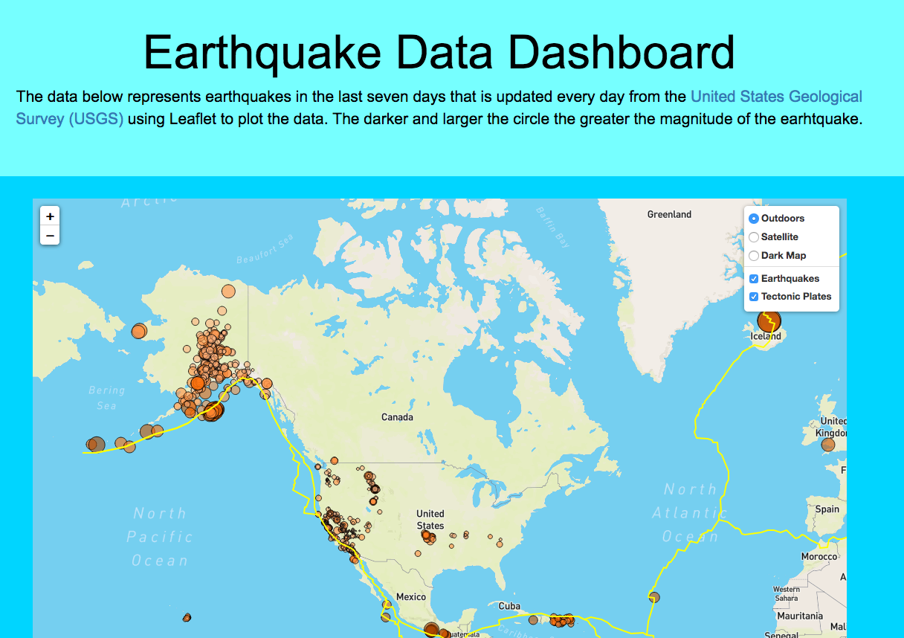

# Visualization for Earthquakes in USA with Leaflet
------
## Visualization of the GeoJSON Earthquake data
- In this project we used the last 7 days of earthquake data provided by USGS [USGS GeoJSON Feed page](https://earthquake.usgs.gov/earthquakes/feed/v1.0/geojson.php) to create a map using Leaflet that plots all the earthquakes data points based on their longitude and latitude

-----

 
  
 

